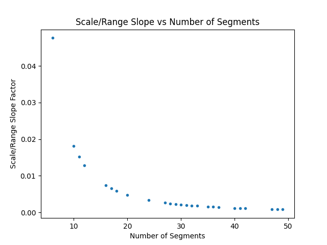
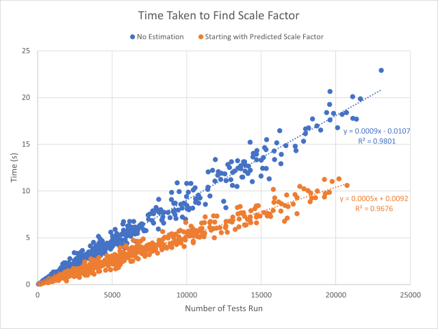

# Looking at Results of Long Solve Method for 250,000 Unique Input Combinations
250,000 test cases were generated using the Long Solve method. This involved 10,000 random range sizes from 100 - 1,000,000 paired with 25 different random choices for number of segments (possible values were 5 - 50).

Charting the scale factors generated vs the range size for these 250,000 cases shows a linear relationship between range size and scale factor. </br>
 </br>
Each different color in the above graph represents scale factor vs range size for only one choice of number of segments. From this, we can deduce that there must be some relationship between the number of segments and the slope of scale factor vs range size. </br>
 </br>

If you've spent some (a lot of) time looking at numbers, you might recognize that shape. It looks just a bit like $1 \over x^2$. If we take a look at the above graph overlayed with a chart of $1 \over x^2$, we can see their very similar. </br>
 </br>
And if we plot the cross-section of our predictions and the actual value found by the Long Solve method, we see a straight line </br>
 </br>
with a slope of (1.69 $\pm$ 0.01). This tells us that the relationship between the number of segments and the scale\range slope is $(1.69 \pm 0.01) \over (number\ of\ segments)^2$. </br>
From here, we can subsitute the prediction for the slope of scale/range into the relationship of scale vs range, or $(1.69 \pm 0.01)\ \dot \ \ Range \over (number\ of\ segments)^2$. </br> </br>
This equation does yeild close results for predicting the actual value of the scale factor, but the predictions have an unsatisfying standard deviation of 200 - too large to yeild accurate predictions. However, if we use this newfound equation for making the initial guess during the Long Solve method, we can reduce the time spent operating. Runtime can be further reduced by using the uncertainty in our predicition for setting the initial value by which we adjust our scale factor guess when it is above or below the true value, or $0.01\ \dot \ \ Range \over (number\ of\ segments)^2$, as it reduces the amount of time spent iterating over small intervals. </br> </br>

To find the affect on performance from using the equation, we adjust the function code from a simple
```
scale_guess = 1.0 # Current guess for the correct scale factor
scaler = 1.0 # Amount to adjust the scale factor guess by when last value of series is not equal to [final_max]
```
to
```
scale_guess = (1.69 * final_max) / (number_of_segments**2) # Current guess for the correct scale factor
scaler = (0.01 * final_max) / (number_of_segments**2) # Amount to adjust the scale factor guess by when last value of series is not equal to [final_max]
```
</br>
and test the two variations on different ranges and number of segments. This algorithm is fairly fast when only running off of one input - resulting in runtimes too small to see the difference in. To see the effect of the equation, we compound it by calling the solve function on a multitude of range sizes and number of segments and adding them all together. However, this still only shows us the effect on performance for one set of range sizes and number of segments. To reveal the true relationship between the equation and runtime performance, we call the solve function on a _multitude of_ a multitude of range sizes and number of segments, and chart the runtime vs total number of tests for each multitude of range sizes and number of segments. </br>

 </br>

As you can see, the equation definitely enhances runtime. Even the slowest runtime using the equation is faster than the best runtime without it for the same number of tests. By finding the slope of the best fit line through each separate dataset, we can see that using the equation results in a runtime that is, on average, 55% faster than solving without the equation. This verifies again that our equation is correct while also giving us a more efficient means of finding the answer.
